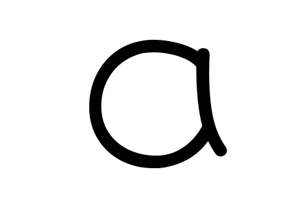
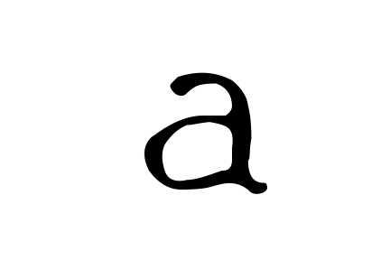
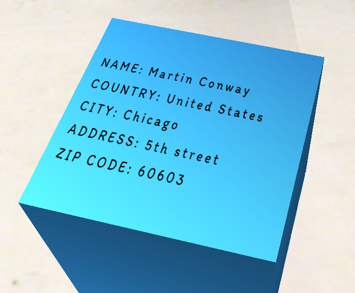
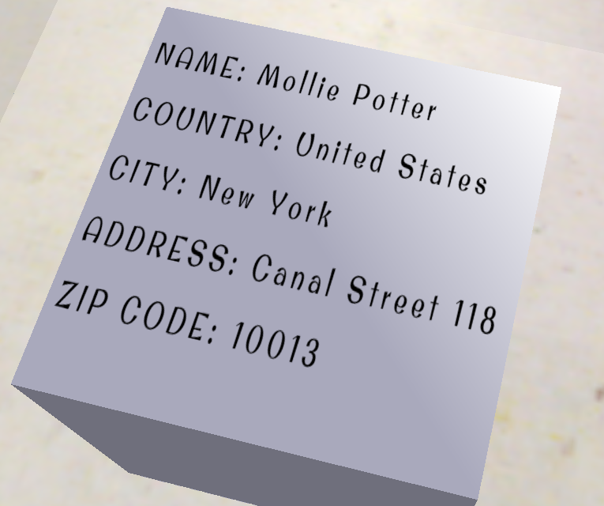
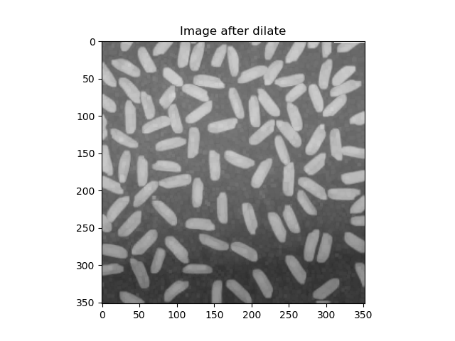
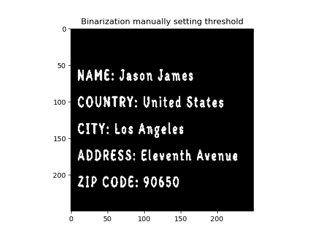
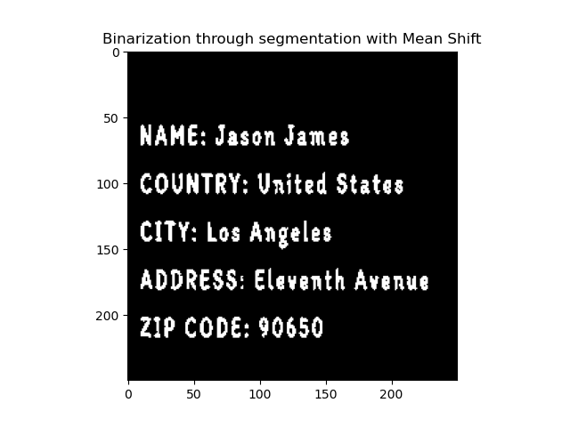
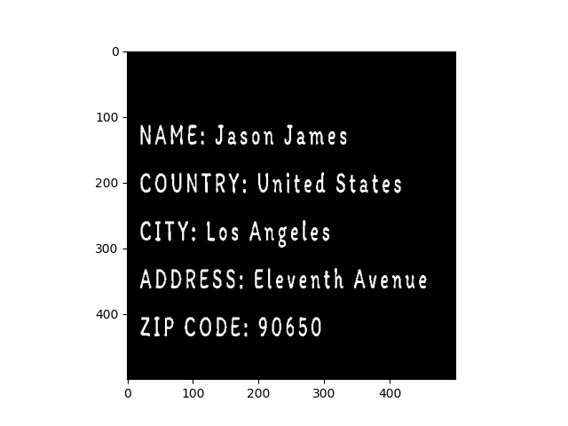

# Warehouse OCR
Optical Character Recognition system to recognize the text inside the labels of warehouse boxes.

## Table of Contents  
 * [Abstract](#Abstract)
 * [Introduction](#Introduction)
 * [Approach](#Approach)
     * [Process flow](#Process-flow)
     * [Datasets used](#Datasets-used)
     * [System performance measurement](#System-performance-measurement)
 * [Experiments, results and analysis](#Experiments,-results-and-analysis)
     * [Multi-layer perceptron training](#)
     * [Perspective removal](#Perspective-removal)
     * [Non-uniform light correction](#Non-uniform-light-correction)
         * [Opening Residue + Mean-shift](#Opening-Residue--Mean-shift)
         * [Niblack method](#Niblack-method)
     * [Region labeling](#Region-labeling)
     * [Image classification](#Image-classification)
 * [Conclusions](#Conclusions)

## Abstract

Recognition of text within images is one of the current challenges in computer vision. Techniques based on powerful and advanced neural networks are currently being used to solve
this challenge. We have tried to take a slightly different approach and we have used both low-level techniques that we have implemented ourselves, as well as the use of a multi-
layer perceptron from the Scikit-Learn library. Prior to recognition, we have carried out perspective corrections on the images using homographies and lighting corrections with Opening Residue and Niblack. We have also implemented the Mean Shift algorithm to perform a first segmentation in which we separate the background from the text to be able to 
automatically binarize in case of using Opening Residue. We have also implemented a region labeling algorithm with connectivity to 8 to be able to label each letter or number with
a region ID and segment them separately, to be able to introduce them into a multilayer perceptron that we have trained to obtain the letter or number to which they belong. The final result of the process is to obtain the text that appears in the image in string format.

## Introduction

In this README we will describe briefly our computer vision system capable of detecting and recognizing the text found on the labels that are attached to the boxes of a warehouse. From an image that will be processed with techniques that we will implement both at a low level and at a high level, our objective is to obtain that text in string format. We will explain the computer vision techniques that we have used to segment and classify images, as well as to correct flaws that they may have during the capture process, such as irregular light or perspective.

This project is useful in automation areas, especially in the new smart warehouses that already exist today. In fact, we have also incorporated this system into an autonomous robot that can collect the boxes from a warehouse and that through its camera will recognize the text of the labels, to know which box have to pick up. You can read more about that other project of ours in it's [own repository page clicking here](https://github.com/abel-gr/warehouse-robot).

## Approach

### Process flow

To solve the problem we will use multiple computer vision techniques, both at a low level and at a higher level. Specifically, the process flow with the steps and techniques that we will apply is as follows:

1. Train a multi-layer perceptron from Python's Scikit-learn library with letter and numbers images that we described above.

2. Generate an algorithm that allows to automatically eliminate the perspective and non-uniform light that the images obtained from the boxes may have and that may affect the classification. In the case of perspective we will use homographies. And in the case of bad light, we implemented the _Opening Residue_ and the _Niblack_ algorithms at a low level, to use both and compare their results. Therefore, to implement the _Opening Residue_, we also implemented _erode_ and _dilate_ techniques of mathematical morphology at a low level.

3. Crop the image to keep the part of the box where only the label is visible.

4. Binarize the image from the results of the _Opening Residue_ or _Niblack_ according to the chosen method by a function parameter. In the case of _Opening Residue_, after correcting the light, we implemented and used _Mean Shift_ to be able to segment all the text without the need to set a threshold.

5. From the previous result, segment each letter separately. For this, we implemented the region labeling technique at a low level.

6. Crop each letter already segmented using a bounding box.

7. Introduce each letter or number image separately to the multi-layer perceptron that we had trained in step 1 to classify and obtain the associated category, which will be related to a character or a number.

As a result of all the previous process we will obtain the complete text in string format.

### Datasets used

Recognizing text within images is a complex process, and even more with the infinite number of fonts that exist. Therefore, we will limit the complexity of our problem using sets of images from known sources as data to train the multilayer perceptron. However, we have chosen fonts that are quite different from each other so as not to reduce the problem difficulty too much. We have generated these images ourselves.

  
  
  
  
  

To generate the dataset we have used the Python _matplotlib_ library that allows us to quickly and easily include text in a plot and then save it as an image to disk.

We have also used the same process to generate the label images, which we have then placed in 3D boxes using the Coppelia robotics simulator. Below we show four photographs that the camera of our warehouse robot has taken on the boxes. The robot has made them in random positions so that they all have different lighting and perspective.

  
  
  
  

### System performance measurement

Since we will generate the images ourselves, we know the desired output label. It is therefore a supervised learning problem. So to measure the performance of character classification performed by the neural network, we can use the metrics obtained from the confusion matrix. Specifically, we will use _accuracy_ because it indicates the proportion of correct predictions among all the predictions made, and it will give us values that we can use to determine if our model is good or not because all the classes of both datasets are balanced. However, we will also use the _precision_ and _recall_ metrics as extras so as not to rely only on one metric.

Measuring the performance of the removal of perspective and irregular light is complex to do automatically since we have nothing to compare it to. Therefore, it is something that we will observe manually until we see that for a set of different images the process is carried out correctly. It is not something that supposes a problem, since it is only a step towards the final objective that is to obtain the complete text in string format. This final part will be evaluated with metrics to ensure that the result is correct for a high percentage of input data. Since our tag generation code knows the text of the tag it is placing, it is again a supervised learning problem. From these images of boxes we will obtain our train and test sets. When testing the final part, we will use the previously mentioned metrics again.

## Experiments, results and analysis

Throughout this section we are going to detail the algorithms that we have implemented and used in order to develop the process flow that we have indicated previously, as well as to show the results and analyze them.

### Multi-layer perceptron training

We have separated into 80% of train and 20% of test the dataset of letters and numbers that we have created and shown before. We have used the train set to train a perceptron with 3 hidden layers of 100, 100 and 50 neurons each. For the best hyperparameter settings, the _accuracy_ has been 0.87. The average _precision_ and _recall_ between all classes have been 0.91 and 0.87 respectively. Below we can see the confusion matrix for the classification of the test data.

### Perspective removal

The images captured by the robot's camera have an irregular and almost random perspective as seen below:

To solve this we first use the contour detector from the _cv2_ library and the result is passed through its Harris corner detector.

Having applied contours, we only have the 4 corners that we want, and we use them as points to calculate a homography with which to eliminate the perspective. Below we show the result:

The system works correctly and automatically for images captured by the robot with different perspectives and angles. This is the only section in which we have used algorithms from libraries (in addition to the scikit-learn MLP) instead of implementing them ourselves at a low level.

### Non-uniform light correction

As we wanted to make the problem realistic, we have included in the scene in which the robot captures the images, light sources with different angles and intensities for each area in which the boxes are located. Therefore, we have implemented 3 algorithms to allow us to correctly correct the non-uniform light and then binarize the images.

#### Opening Residue + Mean-shift

A first approach to solve this problem has been to use _Opening Residue_. For this we have created a function that slides a window through the image, to calculate the minimum or the maximum, as indicated by the parameter. In this way, we take advantage of the created code for both _erosion_ and image _dilation_ of mathematical morphology, modifying a parameter. We create a new function for the _Opening_ that consists of calling our _erode_, and then the _dilate_. We add the _Opening Residue_ function that subtracts the result of the _Opening_ function that we had already created from the original image. Below we show the results of these algorithms:

  
  
  
  
  
  

The problem now is to determine what is the appropriate threshold value to binarize the result of the _Opening residue_, since after performing the process on different images of boxes, the value was always different. For this we have implemented the _Mean Shift_ algorithm. It is a non-parametric clustering technique to locate the maximums of a density function in which a window is determined for each point in the image and the mean of the points in the window is calculated. We move the window to the mean until convergence, obtaining the local maxima of the probability density function, which are the densest regions. We have also implemented this algorithm ourselves, and applied it to the result of the _Opening Residue_ as mentioned. In this way we obtain a certain number of clusters. We simply count how many points belong to each cluster, and the region with the most points is the background that we discard. From the rest of the regions, we eliminate those that have an amount less than a percentage, and we keep the resulting ones, achieving correctly segmenting the text and also remaining binarized for all the cases that we have tested. Below we see the results of binarizing the image obtained applying _Opening Residue_. It can be seen that the result of manually searching for the appropriate threshold (image on the left) and using our method with Mean Shift (image on the right) is practically the same, and the second method has the advantage of being completely automatic for all input images with correct results.

  
  

#### Niblack method

We believe that the light correction results could be even better than what we have shown above. To achieve this we have decided to implement the _Niblack_ algorithm ourselves. This technique allows us to obtain the local threshold for each point in the image from the mean and standard deviation of the neighborhood. The size of the window and the _K_ that multiplies the standard deviation are two parameters that we have included, and that determine the final result. However we have found a good value for both that works on all the label images we have tested. Below we can see the result for the image of rice and the image of the label captured by the camera that we had also tested with the previous method:

  
  

It can be seen in the previous image that the results with Niblack for both images are almost as good as the results obtained with the _Opening Residue_ + _Mean Shift_. However, the technique using _Opening Residue_ and _Mean Shift_ is approximately 30% slower than applying _Niblack_ alone. Therefore we have included both techniques in our final code so that the user can choose through a parameter which one wants to use.

### Region labeling

Once we have the binarized image, we must segment each letter separately. For this we have implemented the region labeling algorithm. First we implemented the connectivity to 4 but there were numbers and letters that separated into two regions. Therefore, we created a second function from the first, and modified it so that the labeling was with connectivity to 8. We see the result below in which each region number has been assigned a color for visualize that each letter and number has been correctly labeled:

Now that each letter is represented by a unique region number, we just had to segment the image by each of these numbers. We apply a bounding box to the result and we obtain each letter cropped and segmented. However, there is another process that we must carry out because the uppercase letters of the phrase were all obtained at the beginning when segmenting them since the labeling algorithm places lower numbers to higher letters because it has found them before. To solve this, after the labeling and bounding box process, we properly order the letters calculating the average value of the positions in X and Y for each letter, obtaining its approximate center. If the mean Y value of a letter is greater than 70% of the size of the letters, it is considered to be a new line of text. In this way we can sort the letters by two variables, by row and by the average value in X. In this way we have all the letters ordered correctly and automatically in all cases. In addition, this is a way to count the lines of text that are in the image automatically. Below we can see an example of the first 9 segmented and cropped letters, with their correct order, after applying these techniques that we have implemented:

### Image classification

Each separate image of a letter or a number is now introduced into the multilayer perceptron that we trained at the begining in order to obtain which letter or number it corresponds to. With the variables of average position in X and Y for each letter that we mentioned in the previous section, we are able to automatically introduce spaces between words and line breaks in the string, and they always coincide with the original image. Below we see the final result of the process in string format:

## Conclusions

With the techniques that we have used, we have been able to recognize the text that is inside images of warehouse boxes and obtain it in _string_ format, so that an autonomous robot equipped with our algorithm is able to determine whether or not to pick up a box from the information on the label. In order to achieve these very good results, it was necessary to use a multilayer perceptron and a consistent multi-stage lower-level image pre-processing. The resolution to this problem has not been easy, since this pre-processing has been critical for the neural network to be able to perform the classification correctly. Without the pre-processing the perceptron was not able to classify practically any letter well. This reveals two important aspects, the first, the great advantage of combining low-level techniques with high-level techniques in computer vision, in order to improve results. And the second, that problems with images captured in realistic environments are difficult to deal with, due to the almost random nature of their capture, both in size, perspective and light. However, we can be satisfied with these correct results without the need to implement the advanced and computationally expensive techniques that are used today in the state of the art.

